Paul Byrne Portfolio 

Description: 

•	Purpose – The purpose of this website is to show prospective employers my skills, my personality and work history. 

•	Functionality / features- On the home page I made it so when you hovered over a certain category in the nav bar it changes the hero image in the centre of the screen to relate to that category.  It was important for me to have the nav bar fixed at all times so the user flow was seamless from page to page, also having calls to action at the bottom of content to prompt employers to contact me. I have also included a grid box on the projects page that wraps to be responsive and links through to the designated projects that I have completed or worked on. 

•	Sitemap - 
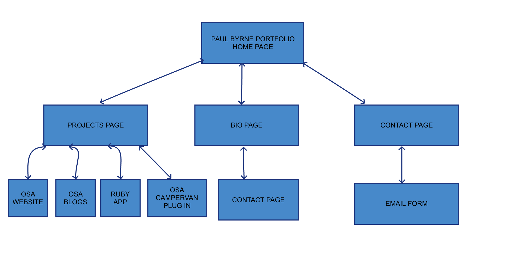

•	Screenshots- 

•	Target audience – Propective employers

•	Tech stack – on this project I used a combination of HTML, CSS, GITHUB, NETLIFY, MOODZER, PENCIL, PHOTOSHOP 

Design documentation -

Design process - 

I found a really cool picture of a guy in a hoodie looking at a sunset and the milky way in the sky, I envisioned hi resolution photos of myself in the bottom centre of the homepage screen that would be interactive with the navigation bar menu at the top of the screen. 

To test if this worked I had a colleague take a couple of photos of me in the same pose as the guy and simlar poses I was thinking of for the design and then uploaded them to my computer to test if my vision would work and look decent with the code I was using. 

It did and I got some professional photographs taken and then cut them out in photoshop and then proceeded to start the coding process. 

The original background image I found ended up looking unprofessional in resizing so I sourced a similar image and continued on from there. 

Using my moodboard I tested out the colour scheme and the fonts I would use. I got inspired from the Falls Festival website and three of the colours they used for their headings. 

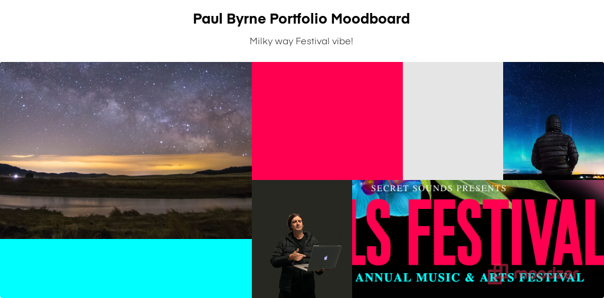

These colours worked with my design and I ended up using them in my hover features for when you hover over the navigation bar menu. 

Wireframes and Figma Mock Ups- 
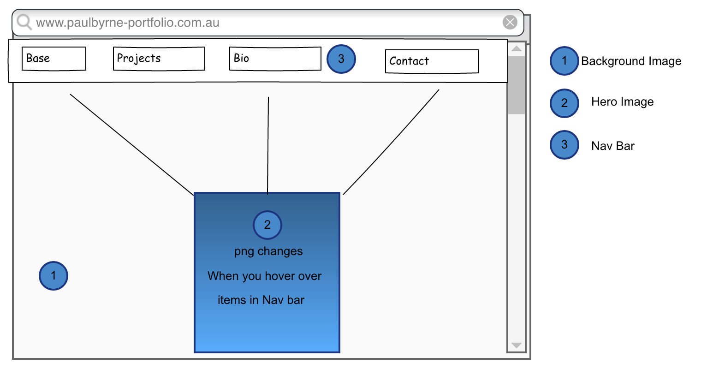
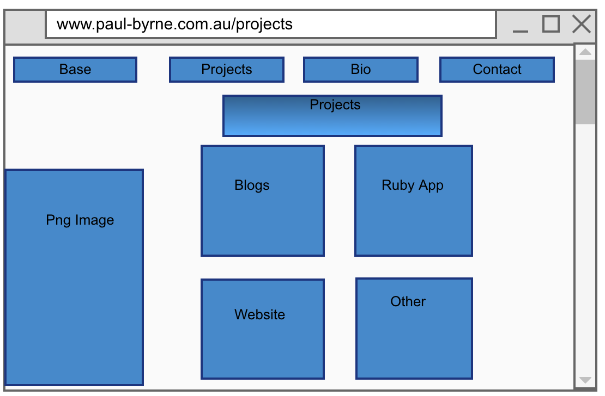
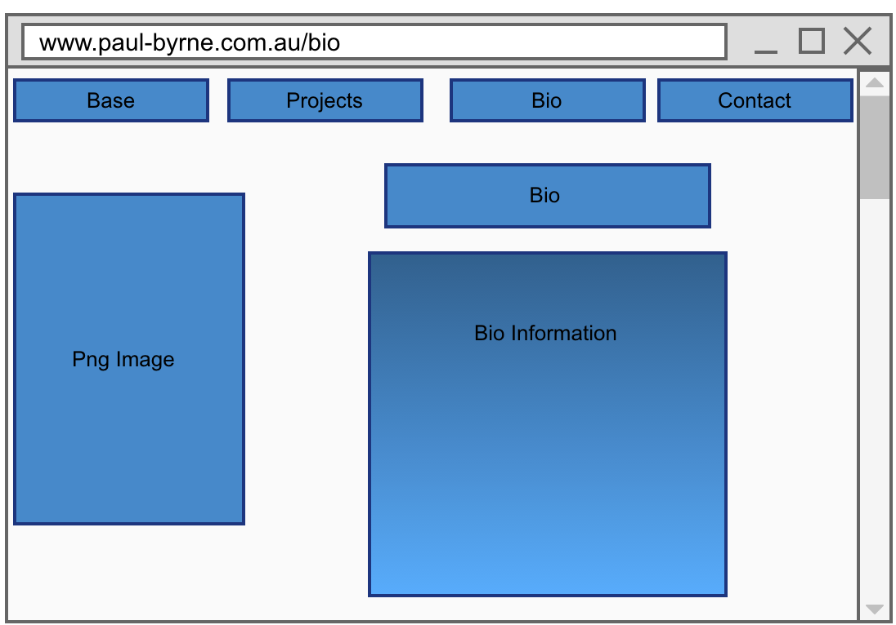
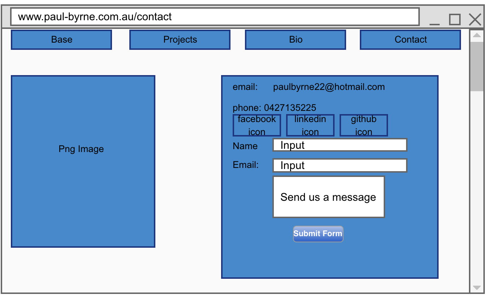
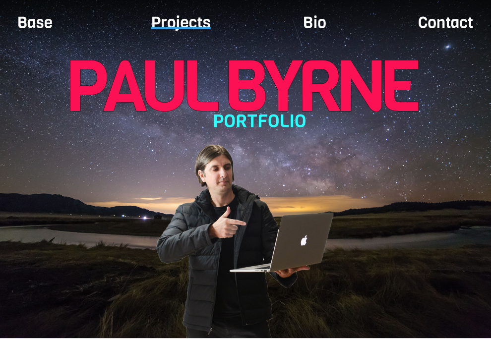
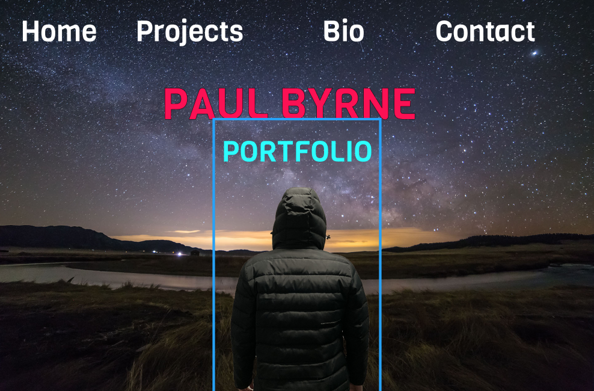
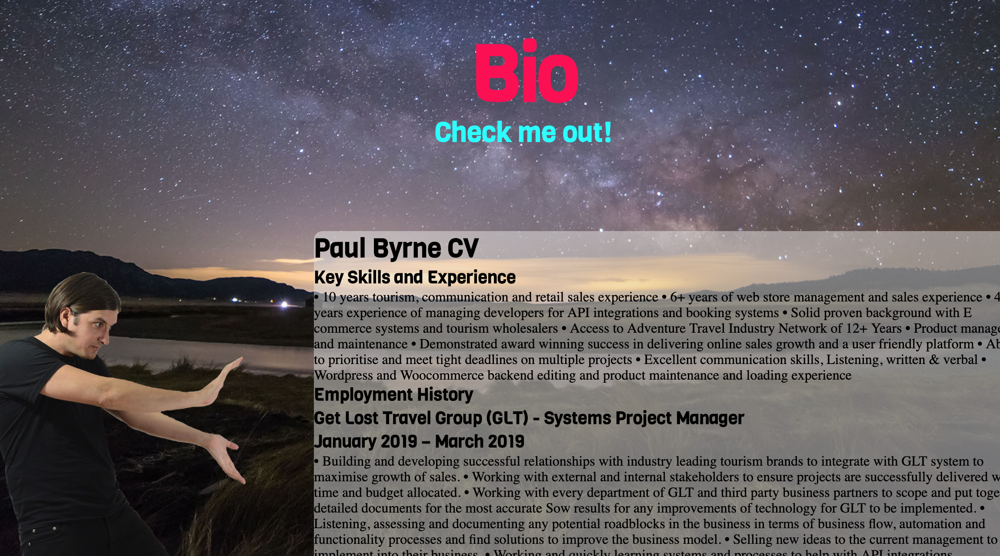

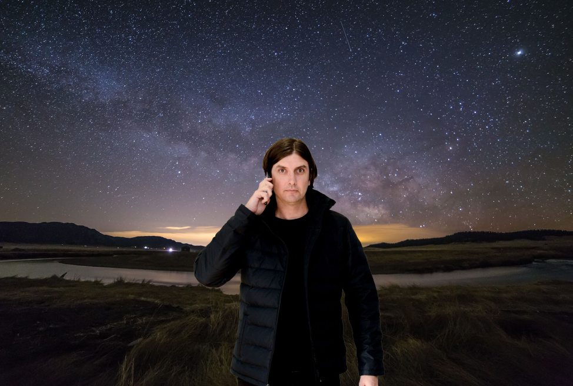
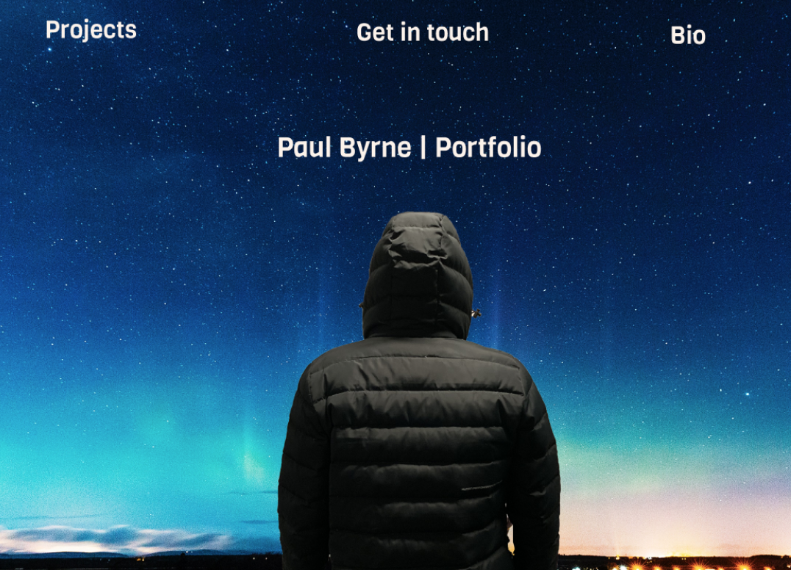

Usability considerations - 

I wanted to make sure that the user flow was seamless from page to page and that my hover functions would give the user a clearer idea of what that category was containing therefore limiting confusion when navigating the website. 

Having a fixed navigation bar at the top of the page at all times and a mobile responsive website was crucial in making sure the user had the option to exit to all available pages at any time. I also wanted to make sure the images worked well when resizing the screen to mobile so having a few media queries and flexbox solved that issue. 

Project plan & timeline - 
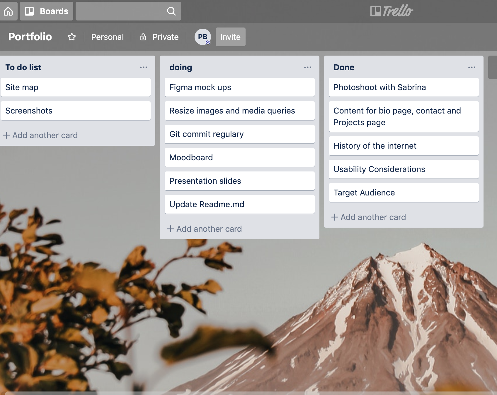

Q: Describe key events in the development of the internet from the 1980s to today?

A: 1981: The National Science Foundation (NSF) provided a grant to establish the Computer Science Network (CSNET) to provide networking services to university computer scientists.

1983: The Domain Name System (DNS) the Internet had a new, easy-to-use system for naming computers. This involved using the idea of the domain name.  

1989: World.std.com becomes the first commercial provider of dial-up access to the Internet.

1991: CERN introduces the World Wide Web to the public.

1992: The first audio and video are distributed over the Internet. The phrase "surfing the Internet" is popularized.

1998: The Google search engine is born, changing the way users engage with the Internet.

2004: Facebook goes online. 

2005: Youtube Launches. 

2009: The Internet marks its 40th anniversary.

2010: Facebook reaches 400 million active users.

2015: Instagram, the photo-sharing site, reaches 400 million users

2016: Google launches Google Assistant, voice activated personal assisant. 

Q: Define and describes the relationship between fundamental aspects of the internet such as: domains, web servers, DNS, and web browsers 
A:  The Internet's system for converting alphabetic names into numeric IP addresses is called a DNS (Domain Name System) For example, when a domain name (Web address (URL) is typed into a browser, DNS servers return the IP address of the Web server associated with that name. 

The web broswer is an application to view websites and a web server communicates with a web browser using the Hypertext Transfer Protocol (HTTP). 

Domain names are one or more IP addresses. 

Reflect on one aspect of the development of internet technologies and how it has contributed to the world today :
A big apspect of the internet that has contributed of the world today is voice activated technologies, now instead of typing in to your device what you wish to order or command you can use your voice to complete the designated task.  You can now book a flight using your voice over the internet or even order a pizza using your voice activation technology. 

